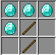

# Reaping

_Harvest your animals in the most cursed way possible._

By using the Reaper you can harvest food from animals as if you had killed them, but without the guilt of killing them -
the reaper tool simply cuts off most of the animal, making them a child again - **science!**

The reapers can be crafted like so:

Available for both Forge and Fabric.

[CurseForge page](https://www.curseforge.com/minecraft/mc-mods/reaping)

[Discord](https://discord.jamalam.tech)
